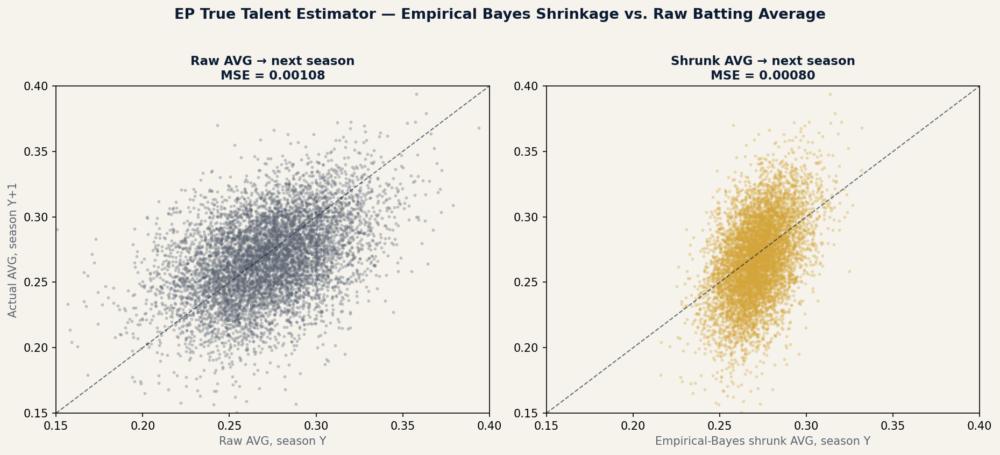

# EP True Talent Estimator (Python / Bayesian statistics)

Empirical Bayes shrinkage for batting average — the classic Efron & Morris
(1975) "Stein's paradox in baseball" method, validated on real Lahman data
(© Chadwick Baseball Bureau / Sean Lahman, CC BY-SA 3.0) with a same-player,
next-season prediction test.

## Result (real data, 1990–2019, min. 200 AB/season)

| | MSE | MAE |
|---|---|---|
| Raw batting average | 0.001082 | 0.02599 |
| Empirical-Bayes shrunk average | 0.000800 | 0.02241 |
| **Improvement** | **26.1%** | **13.8%** |



Shrinking every player's average toward the league mean — by an amount
inversely proportional to his at-bats — predicts that same player's *next
season* better than his raw average does. 7,104 player-season pairs.

## Run it

```bash
pip install pandas numpy matplotlib
python ep_true_talent_estimator.py
```

Downloads Sean Lahman's batting data (CC BY-SA 3.0) automatically on first
run and regenerates `ep_true_talent_estimator.png`.

## Method

Method-of-moments Beta-Binomial empirical Bayes (Efron & Morris, 1975;
popularized for a general audience in David Robinson's *Introduction to
Empirical Bayes: Examples from Baseball Statistics*):

1. Fit a league-wide Beta prior from one season's batting averages, netting
   out ordinary binomial sampling noise from the true spread in talent
2. Shrink each player's average toward that prior, weighted by his AB
3. Validate against next season's actual average — not just claim the
   method works, show the error reduction

## Stated limitations

- **Validation window.** Ground truth is next-*season* performance, not a
  held-out second half of the *same* season (Efron & Morris's original
  design) — the Lahman data used here is season-level totals only. This also
  mixes in real year-over-year talent change (aging, injury), not just
  sampling noise, so the true within-season effect is likely larger than
  what's measured here.
- **Survivorship in the validation set.** ~23% of players who qualify (200+
  AB) in year Y do not qualify again in year Y+1 — they're hurt, benched, or
  out of the league. The comparison above only scores predictions for
  players who qualified in *both* years, so it measures the method on the
  population of hitters who stuck around, not the full population that
  entered year Y. Direction of any resulting bias is not established here.
- **Data license.** Sean Lahman's database, distributed via the Chadwick
  Baseball Bureau, is licensed **CC BY-SA 3.0** (attribution + share-alike
  required) — not public domain.

## Possible next steps

- Rebuild with in-season split data (first half vs. second half) via
  Retrosheet game logs, closer to the original Efron-Morris design
- Extend to a full Bayesian hierarchical model (partial pooling by position
  or league) instead of a single league-wide prior
- Apply the same shrinkage logic to a rate stat with a shorter reliability
  runway (e.g., BABIP) where the effect should be even larger
